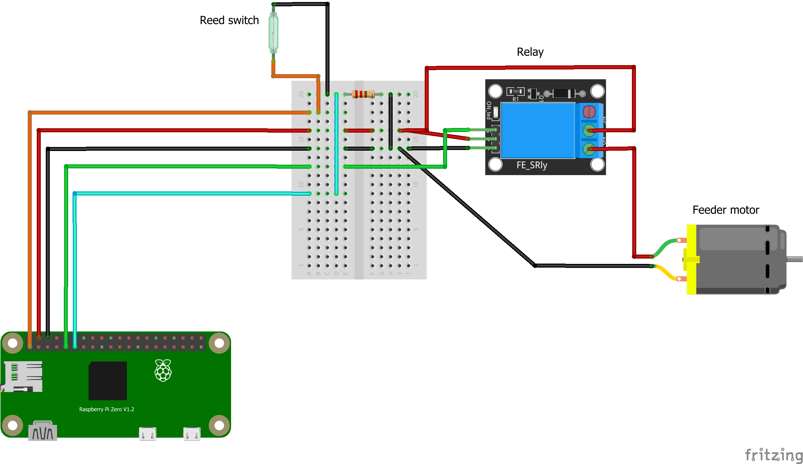

# petfeeder
A Raspberry Pi managed pet feeder with chat and web interfaces

## Purpose

I have one of these petfeeders: https://www.amazon.com/gp/product/B07K9PBMRB
It's logic board is terrible. It resets the scheduling on power loss, and I would have no idea if it fed the cats.
Thus, I've elected to replace that logic board with one that I can manage from a web interface or Telegram, and get notifications when it works.

This is very much a work in progress. I'd like to have alerting/messaging when we don't see food actually dispensed (in case it's empty, or failed) etc... but we'll get there over time.

## Requirements

A petfeeder with circuitry you can mess with (Basically a motor you can put a relay on to control and a reed switch to identify when servings are completed to turn off the motor).

A Raspberry Pi (I'm flipping between a Pi3b and a Pi Zero W) configured to talk on your network.

A Telegram API key (optional) and channel for broadcasting messages (also optional).

A Healthchecks.io account (optional) for alerts when it goes down.

## Instructions

- Set up your Pi as per usual
- Checkout this repo on the Pi in /opt/petfeeder (Or elsewhere, but up to you to fix paths)
- Run bash /opt/petfeeder/install/install.sh, or do what it does yourself
- Reboot the pi and cross your fingers (Or `systemctl daemon-reload` and `systemctl start petfeeder`)
- Load up the pi's IP in a browser, and configure the Telegram integration, Healthchecks, and meals as you desire

## Important security notice

This starts up a webserver on the Raspberry Pi on port 80 (Not SSL because I'm lazy) which grants full access to manage/read schedules and activate the feeder. DO NOT PUT THIS ON THE FUCKING INTERNET.

I take zero responsibility for any "bad things" that may occur due to this.

Also, it doesn't currently do a great job of validating inputs, so if you request negative feedings, it won't start pumping your cat's stomach...it'll probably crash, or do nothing. :shrug:

## Circuitry

5 pins on the Raspi are used:

- 1 Ground - Used to ground everything (duh)
- 1 5v power - Used to run the motor
- 1 3v power - Used to detect action on the reed switch
- 2 GPIO pins
  - 1 for triggering the relay to run the motor
  - 1 for reading from the reed switch

Additionally, I utilized a "SunFounder 2 Channel DC 5V Relay Module with Optocoupler"
However, you could probably use a single channel just as easily:
https://www.amazon.com/WINGONEER-KY-019-Channel-Module-arduino/dp/B06XHJ2PBJ
or similar

You will need a resistor (I used a 1.2k one, not sure it matters much)

There are several circuits you will create with this:

### The motor circuit

There are two loops in this circuit, one for powering the motor, one for controlling it

#### Power

5v on Pi -> Relay common pin
Relay normally closed pin -> Motor positive
Motor negative -> Gnd on Pi

#### Control

5v on Pi -> 5v input on Relay
GPIO 11 on Pi -> Input pin 1 on Relay
Gnd on Pi -> Gnd input on Relay

### The reed switch circuit

3v on Pi -> Reed switch input
Reed switch output -> breadboard channel
breadboard channel -> GPIO 13 on Pi
breadboard channel -> 1.2k Ohm resistor
1.2k Ohm resistor -> Gnd on Pi

I've put the entire circuit diagram into a visual format in case you want to follow along. It could be simpler I'm sure (And I could totally make a PCB for this, I just don't know if I need to at this point).

